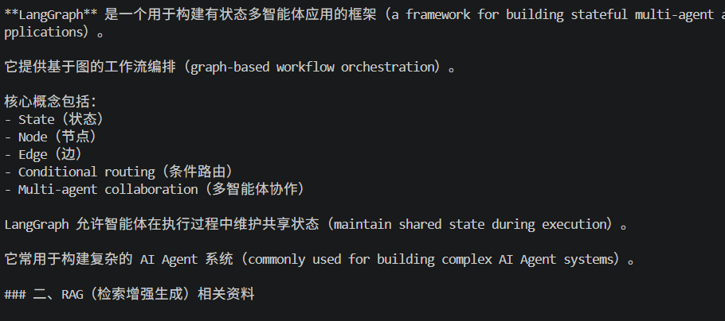

# Deep Research Agent

基于 LangGraph 构建的深度研究智能体（Deep Research Agent）。

本项目实现了一个具备自主检索、知识增强、工具调用和研究总结能力的 LLM Agent 系统。

项目结合：

- LangGraph 工作流编排
- Multi-Agent 智能体协作
- RAG 检索增强生成
- Chroma 向量数据库
- DeepSeek 大语言模型

实现从用户问题输入，到信息检索、分析、反思、总结的完整研究流程。


---

# 项目背景

传统 LLM 存在以下问题：

- 知识存在时效限制
- 容易产生幻觉（Hallucination）
- 缺少外部知识支撑
- 难以处理复杂多步骤任务


因此，本项目设计了一个 Deep Research Agent，使 LLM 能够：

- 根据任务自主选择工具
- 检索外部信息
- 查询本地知识库
- 对结果进行反思分析
- 自动生成结构化研究报告


---

# 系统架构


             用户问题

                |

                v

         Research Agent

                |

    +-----------+------------+

    |                        |

    v                        v

Tavily Search Chroma RAG

网络信息检索 本地知识检索

    |                        |

    +-----------+------------+

                |

                v

          Think Tool

          反思分析

                |

                v

      Research Compression

          研究总结

                |

                v

         最终研究报告


---

# 核心技术实现


## 1. LangGraph Agent 工作流


本项目使用 LangGraph 构建 Agent 工作流。

通过：

- State（共享状态）
- Node（节点）
- Edge（边）
- Conditional Routing（条件路由）

实现研究流程控制。


整体流程：


START

|

LLM 决策

|

工具调用

|

结果分析

|

继续搜索 / 生成报告

|

END


其中 State 负责在不同节点之间共享：

- 用户研究主题
- 中间消息
- 工具返回结果
- 研究笔记
- 最终输出


---

# 2. Agent Tool Calling


Agent 可以根据任务自主选择工具。


目前支持：


## Tavily Search Tool

作用：

用于获取外部实时信息。

适用于：

- 最新资讯
- 网络资料
- 公开信息检索


---

## Chroma RAG Search Tool


作用：

从本地知识库中检索相关资料。


流程：


文档加载

↓

文本切分

↓

Embedding生成

↓

向量数据库存储

↓

相似度检索

↓

LLM生成


---

## Think Tool


用于 Agent 自我反思。


Agent 会分析：

- 当前是否获得足够信息
- 是否需要继续搜索
- 已获取信息是否满足任务要求


---

# 3. RAG 知识增强系统


项目实现完整 RAG Pipeline。


## 数据流程


Markdown知识文档

    |

RecursiveCharacterTextSplitter

    |

BGE Embedding Model

    |

Chroma Vector Database

    |

Similarity Search

    |

LLM增强生成


## Embedding 模型


BAAI/bge-small-zh-v1.5


## 向量数据库


ChromaDB


知识库支持 Metadata：

例如：

```json
{
 "source": "langgraph.md",
 "category": "knowledge_base"
}
4. Multi-Agent 架构设计

项目采用模块化 Agent 设计：

deep_research

├── agents

│
├── research_agent.py
│
├── draft_agent.py
│
├── evaluator_agent.py
│
├── red_team_agent.py
│
└── supervisor.py


不同 Agent 负责不同任务：

Agent	功能
Research Agent	信息搜索与研究分析
Draft Agent	初始报告生成
Evaluator Agent	输出质量评估
Red Team Agent	结果批判与优化
Supervisor	Agent流程协调
示例流程

输入：

什么是 LangGraph，它如何用于构建 AI Agent？

Agent执行：

分析用户任务
调用 Chroma RAG 检索：
LangGraph
RAG
AI Agent Architecture
使用 Think Tool 进行反思
判断是否需要继续检索
压缩研究结果
输出最终报告
技术栈
Agent Framework
LangGraph
LangChain
LLM
DeepSeek LLM
RAG
ChromaDB
HuggingFace Embedding
BAAI/bge-small-zh-v1.5
Search
Tavily Search API
Development
Python
项目结构
deep-research-agent

├── deep_research

│   ├── agents

│   ├── rag

│   ├── tools

│   ├── states

│   └── prompts


├── knowledge_base


├── requirements.txt


├── test_agent.py


└── test_rag.py

项目运行
安装环境
python -m venv .venv

安装依赖：

pip install -r requirements.txt
构建知识库

运行：

python -m deep_research.rag.ingestion

生成 Chroma 向量数据库。

运行 Agent
python test_agent.py
后续优化方向
增加 PDF 文档解析能力
增加网页引用能力
优化 Multi-Agent 并行执行
增加长期记忆 Memory
增加 Agent 自动评测系统
增加 Web UI




## 👨‍💻 Author

**Logic**

Master of Artificial Intelligence

Monash University 

GitHub:
https://github.com/xxxMingxx
