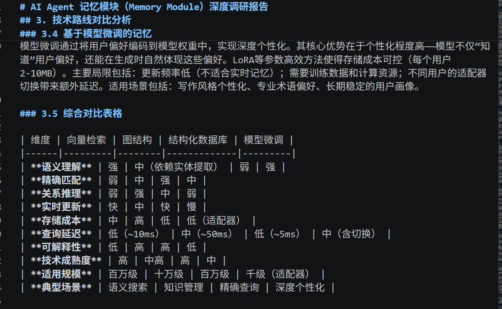

🔬 Deep Research Agent / 深度研究智能体
项目简介 | Introduction

中文

基于 LangGraph 构建的多智能体深度研究系统，实现复杂任务下的自主规划、工具调用、知识检索和研究报告生成。

系统通过 Multi-Agent 架构协调 Research Agent、Draft Agent、Evaluator Agent 等角色，并结合 RAG 技术增强知识检索能力，使 Agent 能够根据任务需求自主选择搜索工具和知识库，完成端到端研究流程。

English

A LangGraph-based multi-agent deep research system that enables autonomous planning, tool calling, knowledge retrieval, and research report generation.

The system coordinates multiple agents including Research Agent, Draft Agent and Evaluator Agent. By integrating RAG and external search tools, the agent can autonomously select information sources and complete end-to-end research workflows.

🏗️ 系统架构 | Architecture
                         用户任务
                      User Query

                            |
                            v

                    Supervisor Agent
                    任务规划与调度
                    Task Planning

                            |
                            v

                    Research Agent

          +-----------------+----------------+

          |                 |                |

          v                 v                v

    Tavily Search      Chroma RAG       Think Tool

    网络搜索            本地知识库        反思推理

          |

          v

       Research Notes

          |

          v

    Compress Research Agent

          |

          v

       Final Report
       最终研究报告

✨ 核心功能 | Features
1. 多智能体协作 | Multi-Agent Collaboration

中文

基于 LangGraph StateGraph 构建有状态 Agent 工作流：

State 状态管理
Node 节点执行
Edge 流程连接
Conditional Routing 条件路由
Multi-Agent Collaboration 多智能体协作

English

Implemented a stateful workflow using LangGraph:

State management
Node-based execution
Edge routing
Conditional branching
Multi-agent collaboration
2. Agent 工具调用 | Agent Tool Calling

中文

Agent 可以根据研究目标自主选择工具：

Tavily Search

用于：

网络信息搜索
最新资料获取
Chroma Search

用于：

本地知识库检索
企业文档查询
Think Tool

用于：

研究过程反思
搜索策略调整

English

The agent can autonomously select tools according to task requirements:

Tavily Search for external information retrieval
Chroma Search for local knowledge retrieval
Think Tool for reflection and reasoning
3. RAG 知识增强 | Retrieval-Augmented Generation

中文

实现完整 RAG Pipeline：

Document Loading
文档加载

↓

Text Splitting
文本切分

↓

Embedding Generation
向量生成

↓

Vector Database
向量数据库

↓

Similarity Retrieval
相似度检索

↓

LLM Generation
生成回答

技术：

Chroma Vector Database
HuggingFace Embedding
BAAI/bge-small-zh-v1.5

English

Implemented a complete RAG pipeline:

Document loading
Text splitting
Embedding generation
Vector database storage
Similarity retrieval
LLM generation
4. Metadata-aware Retrieval

中文

为知识库文档增加 metadata：

{
 "source": "langgraph.md",
 "category": "knowledge_base"
}

支持：

文档来源追踪
检索结果溯源
知识管理

English

Added metadata-aware retrieval for document traceability:

Source attribution
Document tracking
Knowledge management
🛠️ 技术栈 | Tech Stack
类别	技术
编程语言	Python
Agent框架	LangGraph
LLM框架	LangChain
大模型	DeepSeek API
RAG	Chroma + HuggingFace Embedding
搜索	Tavily Search
数据格式	Markdown Knowledge Base
📂 项目结构 | Project Structure
deep_research

├── agents
│   ├── supervisor_agent.py
│   ├── research_agent.py
│   ├── draft_agent.py
│   └── evaluator_agent.py

├── tools
│   └── tool.py

├── rag
│   ├── ingestion.py
│   └── vector_store.py

├── knowledge_base

├── states.py

└── prompts.py

🚀 运行流程 | Workflow

输入：

什么是 LangGraph，它如何用于构建 AI Agent？

Agent 自动执行：

分析任务
选择工具
检索知识库
进行反思
综合研究结果
输出报告
🎯 技术亮点 | Engineering Highlights

中文：

基于 LangGraph 实现状态化 Agent 工作流
实现 Agent 自主工具选择机制
构建 Chroma + Embedding RAG 知识检索系统
支持 Metadata-aware Retrieval
实现 Multi-Agent 深度研究流程

English:

Stateful Agent workflow with LangGraph
Autonomous tool selection
Chroma-based RAG retrieval
Metadata-aware knowledge retrieval
Multi-agent research pipeline

## 👨‍💻 Author

**Logic**

Master of Artificial Intelligence

Monash University 

GitHub:
https://github.com/xxxMingxx
